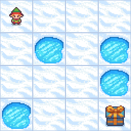

# ⚛ Optimization of Reinforcement Learning with Quantum Computation ⚛

## 📖 Project Overview

This project focuses on optimizing classical Reinforcement Learning (RL) techniques using Quantum Computation. We leverage Quantum algorithms, such as Variational Quantum Circuits (VQCs), to enhance learning in RL environments. The primary goal is to investigate how Quantum Computing can help achieve space optimization in terms of parameters and potentially allow better performance in complex environments.

### ❄ Frozen Lake Environment


This environment involves navigating across a frozen lake without falling into holes, optimizing the policy to avoid dangers.

### 🛤 Cartpole Environment


Cartpole is a classic environment where the goal is to balance a pole on a moving cart, perfect for testing control and RL algorithms.

### 🌙 Lunar Lander Environment


In the Lunar Lander environment, the agent must land a spaceship safely on the moon. It's great for more complex RL experiments with continuous actions.

## 🔍 Key Features:
- Background information on Classical RL and Quantum Computation
- Literature Survey on Existing approaches to QRL
- Implementation of Quantum-enhanced RL using VQC for various OpenAI gym environments.
- Comparative analysis between Classical RL and Quantum RL.
- Performance evaluation using rewards and parameter space optimization.

---

## 📁 Repository Structure

```bash
.
├── Background_Knowledge/                           # Background Knowledge on Topics
│   ├── Background Knowledge.ipynb/ 
├── Literature_Survey/                              # Survey on Existing Literature
|   ├── Literature Survery.ipynb/                  
├── Images/                                         # Images Compilation          
└── README.md                  # Project description and instructions
